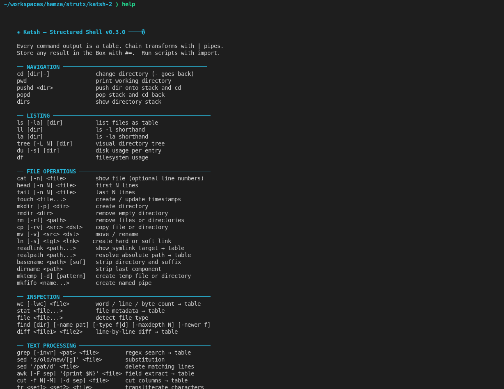
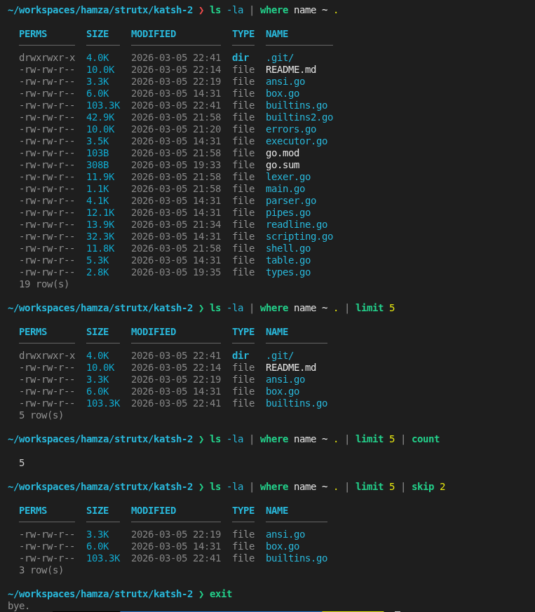
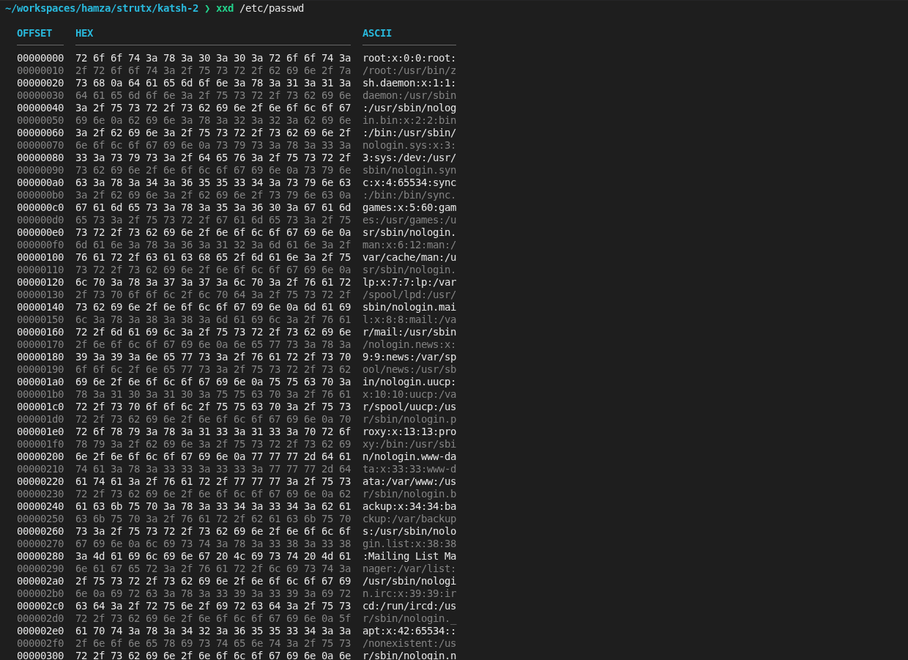

# Katsh

**A structured shell where every output is a table.**

```
  ╔══════════════════════════════════════════════════════╗
  ║  Katsh  ·  Structured Shell  ·  v2.x.x               ║
  ║  Everything is data. Every output is a table.        ║
  ╚══════════════════════════════════════════════════════╝
```

Katsh is a terminal shell written in Go that turns every command output into a structured table you can filter, sort, and pipe — while also being a full scripting language with variables, loops, functions, pattern matching, and an import/export extension system.





---

## Install

```bash
git clone <repo>
cd Katsh
go mod tidy
go build -o Katsh .
./Katsh
```

**Requires:** Go 1.22+ and `golang.org/x/term` (fetched automatically by `go mod tidy`).

---

## Quick Start

```sh
# Every command outputs a table
ls -la
ps aux
ps | where cpu>1.0 | sort cpu desc | limit 10

# Store results in the Box
ls #=files
box get files

# Chain pipes
find . -name "*.go" | grep parser | sort name
curl https://api.example.com/users | where active=true | select name,email | fmt json
```

---

## Terminal Features

| Key | Action |
|-----|--------|
| `↑` `↓` | Navigate command history |
| `←` `→` | Move cursor in line |
| `Ctrl-A` / `Ctrl-E` | Jump to start / end |
| `Ctrl-W` | Delete previous word |
| `Ctrl-K` | Kill to end of line |
| `Ctrl-U` | Clear entire line |
| `Ctrl-L` | Clear screen |
| `Tab` | Complete commands, paths, `$vars`, box keys |

Live **syntax highlighting** as you type: commands green (unknown = red underlined), keywords magenta, `$vars` teal, strings yellow, flags cyan.

**History** is saved persistently to `~/.config/Katsh/history.json` (up to 10,000 entries) and survives restarts.

---

## Pipe Operators

Every command output can be piped through these transforms:

```sh
cmd | select col1,col2        # keep only these columns
cmd | where col=val           # filter rows  (= != > < >= <= ~)
cmd | grep text               # search all columns
cmd | sort col [asc|desc]     # sort rows
cmd | limit N                 # first N rows
cmd | skip N                  # skip N rows
cmd | count                   # count rows
cmd | unique [col]            # deduplicate
cmd | reverse                 # flip order
cmd | fmt json|csv|tsv        # reformat output
cmd | add col=value           # add a computed column
cmd | rename old=new          # rename a column
```

---

## Box — Persistent Result Storage

```sh
ls #=           # auto-store with generated key
ls #=myfiles    # store with named key
box             # list all stored results
box get myfiles # retrieve
box rm myfiles  # delete
box rename myfiles files2
box tag files2 important
box search "go"
box export backup.json
box import backup.json
box clear
```

---

## Scripting Language

### Variables

```sh
x = 42
name = "Alice"
greeting = "Hello, $name!"         # interpolation
raw = 'no $interpolation here'
result = `ls | count`              # subshell capture
n = if $x > 10: "big"; else: "small"  # ternary

# Arithmetic
x += 1      x -= 1      x *= 2
x /= 2      x %= 3      x **= 2
x++         x--         ++x

# Arrays
colors = ["red", "green", "blue"]
colors[] = "yellow"                 # append
colors[0] = "crimson"              # index assign
first = colors[0]
len = colors.len

# String ops
line = "─"x60                      # repeat
full = "Hello" . " " . $name       # concatenate
```

### String Interpolation

```sh
greet = "Hello, ${name}!"
default = "${USER:-guest}"          # default if unset
length = "${#name}"                 # string length
conditional = "${name:+Hi $name}"   # expand only if set
```

### If / Elif / Else

```sh
if $x > 0: echo "positive"

if $x > 0: echo "pos"; elif $x == 0: echo "zero"; else: echo "neg"

if $score >= 90 {
    echo "A grade"
} elif $score >= 80 {
    echo "B grade"
} else {
    echo "Try harder"
}

unless $name == "": echo "Hi $name"
```

### Match / Case

```sh
match $color {
    case "red":   echo "stop"
    case "green": echo "go"
    case "red"|"orange": echo "caution"
    case *:       echo "unknown color"
}

match $score {
    case >= 90: echo "excellent"
    case >= 70: echo "good"
    case < 50:  echo "fail"
    default:    echo "average"
}

# Glob patterns
match $file {
    case "*.go":   echo "Go source"
    case "*.json": echo "JSON data"
    case "test_*": echo "test file"
}
```

### For Loops

```sh
for i in range(0, 10): echo $i
for i in range(1..100): echo $i

for name in ["Alice", "Bob", "Carol"]: echo "Hi $name"

for file in `ls | select name`: echo $file

for item in $myarray: echo $item

for i in range(0, 10) {
    if $i == 5: break
    echo $i
}
```

### While / Do-While

```sh
x = 0
while $x < 10: x++

while $running != false {
    echo "tick"
    sleep 1
}

# Post-condition (always runs at least once)
do { x++; echo $x } while $x < 5
do { echo "try"; attempt++ } until $success == true
```

### Repeat

```sh
repeat 3: echo "hello"

repeat $n {
    echo "iteration $_i"    # $_i = current index (0-based)
}
```

### Try / Catch / Finally

```sh
try {
    rm important-file.txt
} catch {
    echo "Something went wrong"
}

try {
    curl https://api.example.com
} catch e {
    echo "Error: $e"
} finally {
    echo "Request finished"
}
```

### Functions

```sh
func greet(name) {
    echo "Hello, $name!"
}

func add(a, b) {
    return $a + $b
}

func factorial(n) {
    if $n <= 1: return 1
    prev = factorial `echo $n - 1 | bc`
    return $n * $prev
}

# Call
greet "World"
result = add 3 7
echo $result        # 10

# Variadic: extra args go into $_args
func log(level, msg) {
    echo "[$level] $msg  extra: $_args"
}
log "INFO" "started" "tag1" "tag2"
```

### Boolean Operators

```sh
# Short-circuit
-f config.json && echo "config found"
ping -c1 google.com || echo "no internet"

# In conditions
if $x > 0 and $x < 100: echo "in range"
if $name == "" or $name == "anon": echo "no name"
if not $debug: echo "production mode"

# Test flags
if -f myfile.txt: echo "file exists"
if -d /tmp: echo "is directory"
if -z $var: echo "var is empty"
if -n $var: echo "var is set"
```

---

## Import / Export

### Importing Scripts and Extensions

```sh
# Local file
import "utils.ksh"
import "./lib/helpers.ksh"

# Remote URL (cached for 24h in ~/.config/Katsh/extensions/)
import "https://example.com/mylib.ksh"

# GitHub shorthand (fetches raw.githubusercontent.com)
import "username/repo/path/to/script.ksh"
```

### Exporting

```sh
# Export a variable to the OS environment
export PATH=$PATH:/usr/local/mybin
export DEBUG=true

# Export a function (marks it available to child shells)
export func greet

# List all exported variables
export
```

---

## Commands Reference

### Navigation
`cd`  `pwd`  `pushd`  `popd`  `dirs`

### Files & Directories
`ls` `ll` `la`  `tree`  `du`  `df`  `stat`  `file`  `find`
`cat`  `head`  `tail`  `touch`  `mkdir`  `rmdir`  `rm`  `cp`  `mv`  `ln`
`wc`  `diff`  `chmod`  `chown`  `readlink`  `realpath`  `basename`  `dirname`
`mktemp`  `mkfifo`  `lsblk`  `mount`  `blkid`

### Text Processing
`grep`  `sed`  `awk`  `cut`  `tr`  `sort`  `uniq`  `tee`  `split`  `xargs`
`nl`  `fold`  `expand`  `unexpand`  `column`  `paste`  `comm`  `shuf`
`reverse`  `strings`  `xxd`  `numfmt`

### Processes & System
`ps`  `kill`  `sleep`  `jobs`  `nice`  `timeout`  `pgrep`  `pkill`  `nohup`
`top`  `lsof`  `vmstat`  `iostat`  `free`  `lscpu`  `dmesg`
`uname`  `uptime`  `date`  `cal`  `hostname`  `whoami`  `id`  `groups`  `who`
`systemctl`  `service`  `journalctl`

### Networking
`ping`  `curl`  `wget`  `nslookup`  `dig`  `ifconfig`  `ip`
`ss`  `netstat`  `traceroute`  `mtr`  `openssl`  `ssh`  `scp`  `rsync`
`httpget`  `httppost`  `jq`

### Hashing & Crypto
`md5sum`  `sha1sum`  `sha256sum`

### Archives
`tar`  `gzip`  `gunzip`  `zip`  `unzip`

### Text Generation
`echo`  `printf`  `yes`  `seq`  `base64`  `bc`  `factor`  `random`

### Shell / Session
`set`  `unset`  `vars`  `export`  `import`  `env`  `printenv`
`alias`  `unalias`  `aliases`  `which`  `type`
`history`  `source`  `watch`  `eval`  `exec`  `test`
`read`  `mapfile`  `declare`
`clear`  `help`  `man`  `exit`

### Box Storage
`box`  (subcommands: `get` `rm` `rename` `tag` `untag` `search` `export` `import` `clear`)

### Fun
`figlet`  `matrix`  `lolcat`  `drawbox`  `notify`

---

## Error Messages

Errors include the exact source line, a caret pointing to the problem token, a hint, and a suggested fix:

```
  SyntaxError[E002] expected ':' in while statement
  │ while x < 100 echo $x
  │            ^── here
  ╰─ 💡 hint: Check for missing colons, brackets, or mismatched quotes
     fix :  while x < 100: echo $x
```

Typo correction on unknown commands:

```
  CommandNotFound[E001] command not found: "grpe"
  │ grpe "hello" file.txt
  │ ^── here
  ╰─ 💡 hint: "grpe" is not a built-in or executable in $PATH
     fix :  did you mean: grep
```

---

## File Layout

| File | Purpose |
|------|---------|
| `main.go` | Entry point |
| `shell.go` | REPL, history persistence, capture mode |
| `readline.go` | Raw terminal: arrow keys, history, tab completion, syntax highlight |
| `scripting.go` | Full scripting engine: variables, if/match/for/while/try/func |
| `lexer.go` | Tokeniser with exact line+col tracking for error messages |
| `parser.go` | Command line parser (pipes, `#=` store, `&` background) |
| `builtins.go` | ~70 built-in commands (navigation, files, text, network, …) |
| `builtins2.go` | 50 additional commands + import/export extension system |
| `pipes.go` | Pipe transform engine (where, sort, select, fmt, …) |
| `errors.go` | Rich error reporting with hints, fixes, and traces |
| `box.go` | In-memory result storage with tagging, search, export |
| `table.go` | Table rendering with semantic column colouring |
| `executor.go` | External command runner |
| `ansi.go` | Terminal colour helpers and prompt rendering |
| `types.go` | Shared types: `Result`, `Row`, `ParsedCommand`, `BoxEntry` |

---

## License

MIT